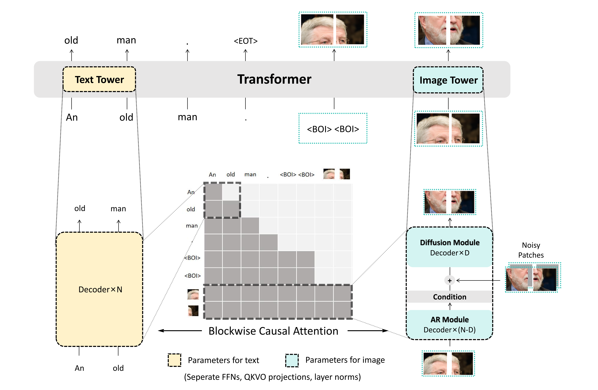

<h1 align="center">MADFormer: Mixed Autoregressive and Diffusion Transformers for Continuous Image Generation</h1>

This repository contains the official implementation of **MADFormer**, a unified generative model that fuses the global modeling of **autoregressive transformers** with the fine-grained refinement capabilities of **diffusion models**. MADFormer introduces a flexible, two-axis hybrid framework—mixing AR and diffusion across spatial blocks and model layers—delivering strong performance under compute constraints while maintaining high visual fidelity across image generation tasks.

<div align="center">
<a href='https://arxiv.org/pdf/2506.07999'></a>
</div>

## Overview

**MADFormer** (**M**ixed **A**utoregressive and **D**iffusion Transformer) bridges the strengths of autoregressive (AR) and diffusion modeling in continuous image generation. It predicts M image patches at a time and uses the predicted patches as gold context for predicting the next patches. During each multi-patch prediction, it uses the first N transformer layers as AR layers for a one-pass prediction, and uses the rest layers as diffusion layers that are called recursively to refine the prediction. Users can choose how "AR" or "diffusion" the model is on two axes: the horizontal token axis (by adjusting M) and the vertical model layer axis (by adjusting N). One interesting finding from our paper is that models with a stronger AR presence performs better under constrained inference budget.

<p align="center">
  
</p>

The generation process of MADFormer: each image block is autoregressively predicted, then refined through a conditioned diffusion process.  

MADFormer acts not only as a performant generator for high-resolution data like **FFHQ-1024** and regular images like **ImageNet-256**, but also as a **testbed** for exploring hybrid design choices. Notably, we show that **increasing AR layer allocation** can improve FID by up to **60–75%** under constrained inference budgets. Our modular design supports controlled experiments on inference cost, block granularity, loss objectives, and layer allocation—offering actionable insights for hybrid model design in multimodal generation.

## Setup
To set up the runtime environment for this project, install the required dependencies using the provided requirements.txt file:
```bash
pip install -r requirements.txt
```

## Training

To train MADFormer on ImageNet-256, first download the dataset locally using Hugging Face `datasets`:

```bash
export HF_TOKEN=<your_huggingface_token>
python -c "from datasets import load_dataset; import os; SAVE_DIR='./dataset/imagenet'; os.makedirs(SAVE_DIR, exist_ok=True); ds=load_dataset('timm/imagenet-1k-wds', split='train', num_proc=24, token=os.getenv('HF_TOKEN')); ds.save_to_disk(SAVE_DIR)"
```

Our training configurations are provided in the `configs` directory, complete with model and training hyperparameters. You can use the following command to start training (arguments are set to reproduce ImageNet-256 baseline results by default):

```bash
torchrun \
    --rdzv_backend c10d \
    --rdzv_id=456 \
    --nproc-per-node=8 \
    --nnodes=1 \
    --node_rank=0 \
    --rdzv-endpoint=<rdvz_endpoint>  \
    src/train.py --id=<experiment_id>
```

We have tested our training scripts on **ImageNet-256** dataset with 64 A100 GPUs.

## Sampling

After training your own checkpoint, you can sample images with:

```bash
python src/sample.py \
    --ckpt /Your/Checkpoint/Path/ckpts.pt \
    --gen_num 8 --class_num 8 # Set class_num to gen_num to sample less than 1000 images
```

## Evaluation

We adopt **Fréchet Inception Distance (FID)** as our primary evaluation metric for image quality. For **ImageNet-256**, FID is computed over 50,000 generated samples. Image generation is performed with the **DDIM sampler** , using 100 sampling steps for ImageNet. To ensure stability, final FID scores are averaged across the last five checkpoints (saved every 10,000 steps). 

FID scores are computed using the [pytorch-fid](https://pypi.org/project/pytorch-fid/) library.

## Acknowledgements
This code is mainly built upon the [ACDiT](https://github.com/thunlp/ACDiT) repository.

## License
This project is liscenced under the Apache-2.0 liscence.

## Citation

If you find MADFormer useful in your research, please consider citing our paper:

```bibtex
@article{MADFormer,
    title={MADFormer: Mixed Autoregressive and Diffusion Transformers for Continuous Image Generation}, 
    author={Junhao Chen and Yulia Tsvetkov and Xiaochuang Han},
    journal={arXiv preprint arXiv:2506.07999},
    year={2025}
}
```